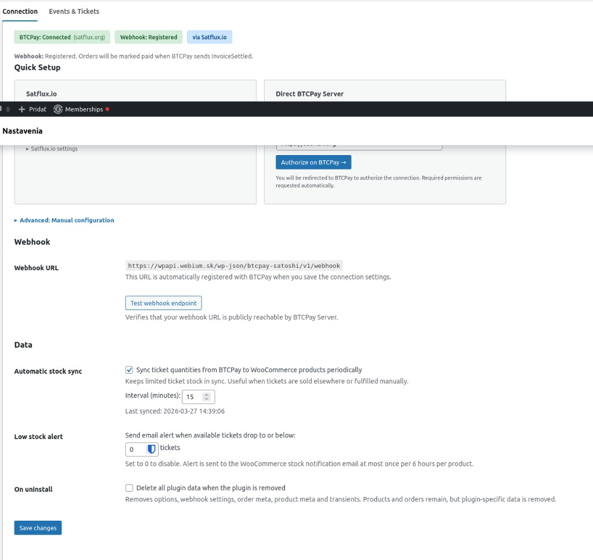
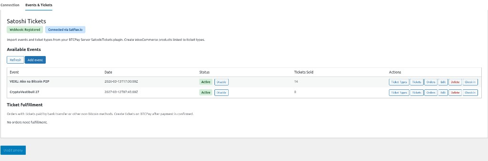
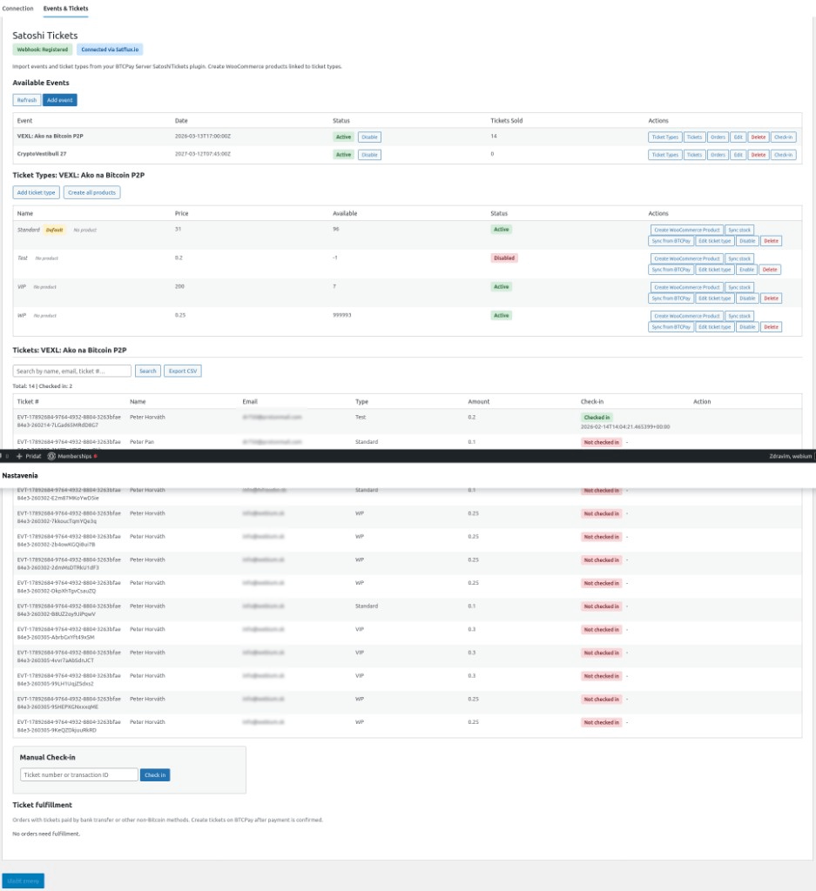
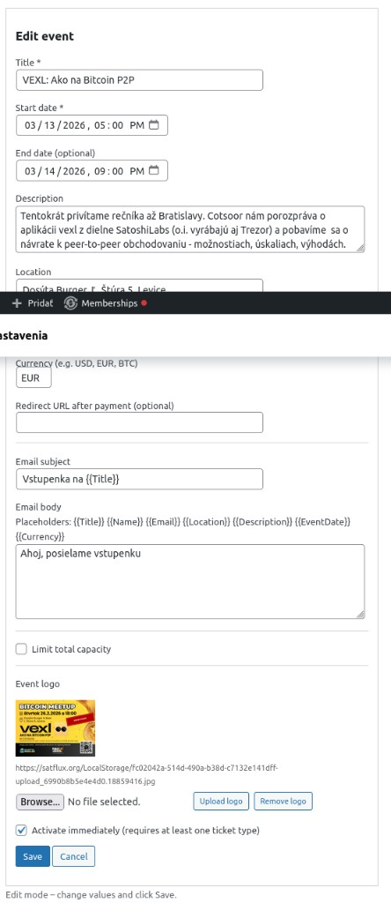
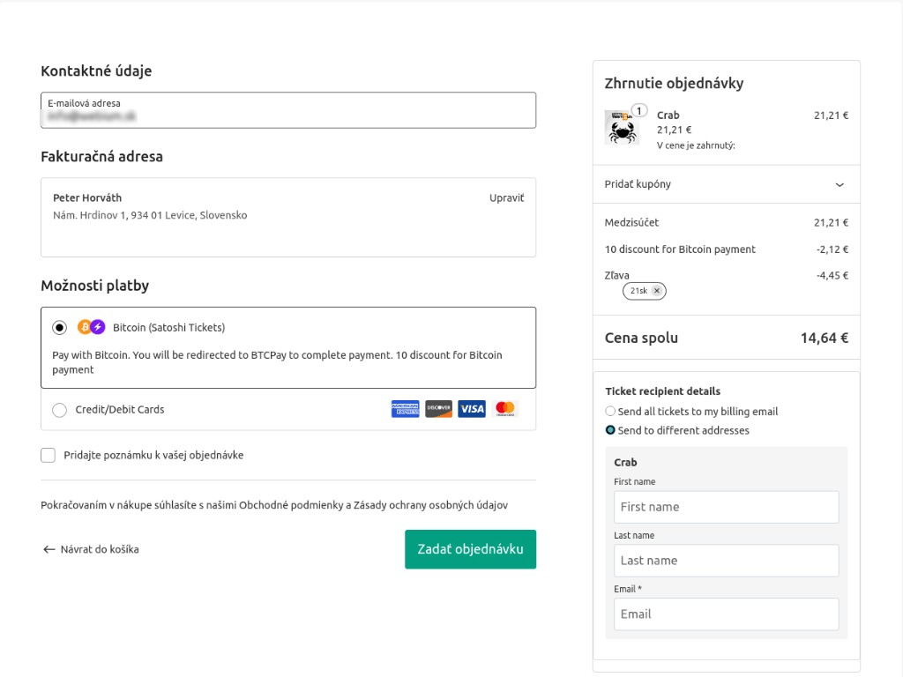
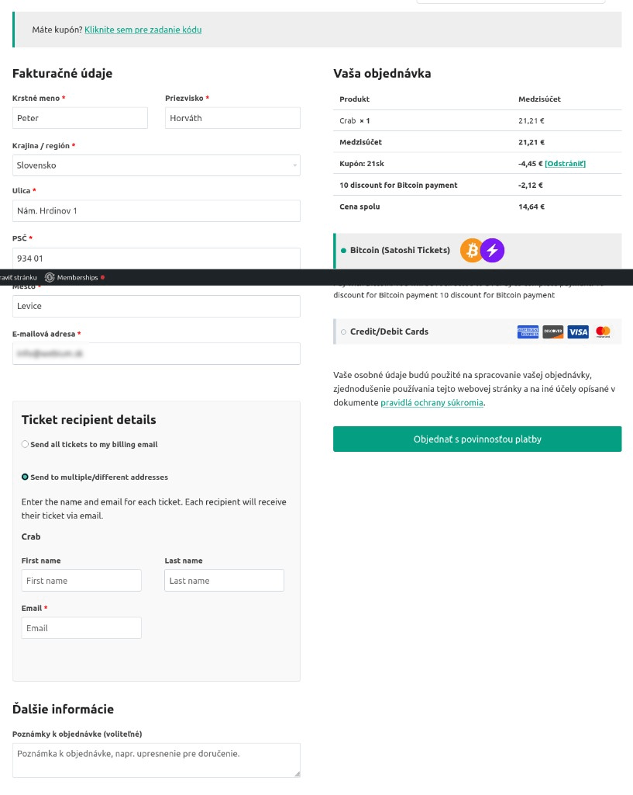

# BTCPay Satoshi Tickets for WooCommerce

WordPress plugin that integrates [SatoshiTickets](https://github.com/TChukwuleta/BTCPayServerPlugins/tree/main/Plugins/BTCPayServer.Plugins.SatoshiTickets) (BTCPay Server event ticketing) with WooCommerce. Sell **event tickets only** via WooCommerce with payments through BTCPay Server. The payment method appears only when the cart contains ticket products. For selling merch or other products, install [BTCPay Greenfield for WooCommerce](https://wordpress.org/plugins/btcpay-greenfield-for-woocommerce/) separately. Works **with or without** the BTCPay Greenfield plugin.

## Requirements

- WordPress 5.8+
- WooCommerce 6.0+ (tested up to 8.5)
- PHP 8.0+
- BTCPay Server with SatoshiTickets plugin installed and configured
- Optional: [BTCPay Greenfield for WooCommerce](https://wordpress.org/plugins/btcpay-greenfield-for-woocommerce/) – if installed, this plugin can use its connection (URL, API key, Store ID) or your own settings

## Features

- **Standalone connection** – Configure BTCPay Server directly (URL, API key, Store ID) or override/use BTCPay Greenfield settings
- **Admin:** Browse events and ticket types from BTCPay SatoshiTickets
- **Products:** Create WooCommerce products for ticket types (one click from admin)
- **Checkout:** Recipient details (name, email) per ticket; supports multiple tickets
- **Payment:** “Bitcoin (Satoshi Tickets)” gateway – shown only when cart contains ticket products (from one event); redirect to BTCPay checkout; order completion via own webhook
- **Webhook:** Plugin registers its own webhook with BTCPay (event `InvoiceSettled`)
- **Stock sync:** Periodic sync of ticket quantities from BTCPay to WooCommerce products (optional, configurable interval in minutes)
- **Satflux.io:** Quick connect via Satflux.io (URL + “Connect to Satflux.io” button)
- **WooCommerce Blocks & HPOS:** Compatible with block-based checkout and Custom Order Tables
- **Data cleanup:** Optional deletion of all plugin data on uninstall

## Installation

1. Install and activate WooCommerce.
2. (Optional) Install BTCPay Greenfield for WooCommerce – if you use it, you can use its connection or enter your own.
3. Create an API key on your BTCPay Server with **`Can modify store settings`** (`btcpay.store.canmodifystoresettings`) or webhook modification permission – in BTCPay: Account → API Keys → Generate key → select your store and enable “Can modify store settings”.
4. Install and configure the SatoshiTickets plugin on your BTCPay Server.
5. Upload this plugin to `wp-content/plugins/btcpay-greenfield-tickets` (or `btcpay-satoshi-tickets` depending on folder name).
6. Activate the plugin.
7. In **WooCommerce → Settings → Satoshi Tickets**, fill in the Connection settings and save – the webhook will be registered automatically.

## Usage

### Settings (WooCommerce → Settings → Satoshi Tickets)

The **Satoshi Tickets** tab has two sections (sub-tabs):

- **Connection** – Quick connect via Satflux.io or manual: BTCPay Server URL, API key, Store ID; webhook is registered when you save. **Data** section: automatic stock sync (enable/disable, interval in minutes), delete data on uninstall.
- **Events & Tickets** – Browse events, ticket types, and create WooCommerce products.

#### Satflux.io quick connect

For Satflux.io users: enable “Quick connect to Satflux.io”, enter the Satflux.io URL if needed, and click “Connect to Satflux.io”. After authorization, BTCPay credentials are filled in automatically. In the Satflux section you can set **BTCPay Store ID** (your BTCPay Server store GUID) and **Satflux Store ID (for Check-in)** – the latter is used for Check-in links in Events; you find it in your Satflux.io dashboard, or it may be returned in the connect callback as `satflux_store_id`. The plugin calls Satflux with `return_satflux_store_id=1` in the connect URL to request the Satflux Store ID for check-in. Satflux should implement the flow at `/woocommerce/satoshi-tickets/connect?return_url=...&return_satflux_store_id=1` and redirect back with `?satflux_return=1&btcpay_url=...&api_key=...&store_id=...`. When `return_satflux_store_id=1` was present in the request, Satflux should append `&satflux_store_id=...` to the redirect URL so the plugin can save it as Satflux Store ID (for Check-in).

### Creating ticket products

1. Go to **WooCommerce → Settings → Satoshi Tickets → Events & Tickets** (or **WooCommerce → Satoshi Tickets**).
2. Click **View Ticket Types** for an event.
3. Next to a ticket type, click **Create WooCommerce Product**.
4. The product is created and opened for editing (you can adjust image etc.).

### Checkout flow

The Satoshi payment method is shown **only when the cart contains ticket products** (from one event). Mixed carts (tickets + other products) are not supported – use separate checkouts or BTCPay Greenfield for non-ticket products.

1. Customer adds ticket products to cart (tickets from one event only; no mixing with regular products).
2. At checkout, recipient fields appear for each ticket.
3. Customer selects “Bitcoin (Satoshi Tickets)” and completes the order.
4. Redirect to BTCPay to pay.
5. After payment, SatoshiTickets sends ticket emails with QR codes.

### Webhook

The plugin uses its **own** REST webhook (`/wp-json/btcpay-satoshi/v1/webhook`). When you save the Connection settings, the webhook is registered with BTCPay for the `InvoiceSettled` event. It does not share a webhook with the BTCPay Greenfield plugin – no extra configuration needed.

## API

The plugin uses the SatoshiTickets Greenfield API:

- `GET /api/v1/stores/{storeId}/satoshi-tickets/events` – List events
- `GET /api/v1/stores/{storeId}/satoshi-tickets/events/{eventId}/ticket-types` – List ticket types
- `POST /api/v1/stores/{storeId}/satoshi-tickets/events/{eventId}/purchase` – Create purchase (returns checkout URL)

## Screenshots

### Connection

### Events & Tickets

### Event detail and ticket types

### Edit event

### Checkout (Blocks)

### Checkout (Classic)

## License

MIT
